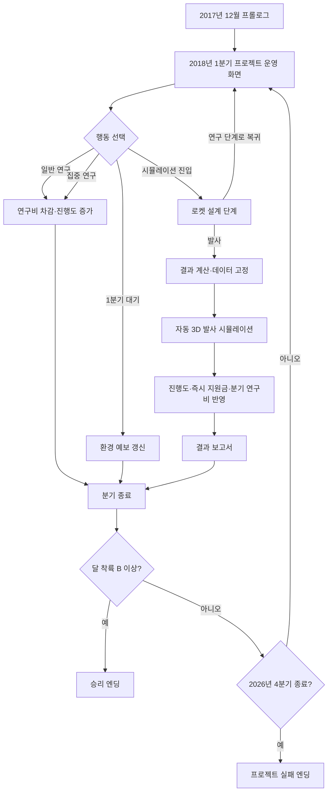
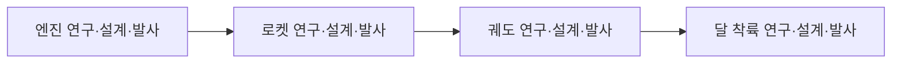

# 02. 전체 플레이 흐름

> 상태: **확정**  
> 시간 단위: 1턴 = 1분기 = 3개월

## 1. 전체 상태 흐름



## 2. 프롤로그

프롤로그는 20~30초 안에 끝난다. 별도의 대화 시스템을 만들지 않고 정지 화면, 통신음, 짧은 텍스트로 구성한다.

권장 순서:

1. 검은 화면과 전화 또는 보안 통신음
2. `2017.12`
3. “2026년까지 유인 우주선을 달에 착륙시키십시오.”
4. 프로젝트명 `ARTEMIS: 2026`
5. 운영 화면으로 전환

프롤로그는 첫 실행에만 자동 재생하되, 클릭으로 건너뛸 수 있다.

## 3. 한 분기의 처리 순서

플레이어는 현재 분기에 아래 행동 중 하나만 선택한다.

1. 현재 활성 단계의 일반 연구
2. 현재 활성 단계의 집중 연구
3. 현재 활성 단계의 시뮬레이션 진입
4. 이전 단계의 연구 또는 설계·발사 재시도
5. 1분기 대기

행동 처리 순서는 아래와 같다.

```text
행동 가능 여부 검사
→ 연구/대기라면 기존 규칙대로 비용·진행도·분기 종료 처리
→ 시뮬레이션 진입이면 로켓 설계 단계 씬으로 이동
→ 설계 단계에서 맵과 목표 경로 확인
→ 부품 위치, 힘, 방향 조정
→ 발사 전이면 연구 단계로 무비용·무시간 복귀 가능
→ 발사 버튼 선택 시 비용 차감
→ 연구·환경·설계 적합도로 결과 계산 및 고정
→ 자동 3D 발사 시뮬레이션 재생
→ 진행도와 연구비 변화 적용
→ 결과 보고서 표시
→ 현재 분기 종료
→ 분기 정기 연구비 지급
→ 날짜를 다음 분기로 이동
→ 환경 예보 한 칸 이동 및 새 예보 생성
→ 단계 해금 또는 게임 종료 검사
```

로켓 설계 단계에 들어가는 것만으로는 분기, 연구비, 발사 횟수를 소비하지 않는다. 최종 `발사` 버튼을 누르는 순간만 되돌릴 수 없는 행동으로 처리한다.

## 4. 플레이어의 반복 판단

운영 화면에서 매 분기 다음 질문에 답하게 한다.

- 현재 단계의 진행도가 설계·발사하기에 충분한가?
- 현재 환경 때문에 성공 확률이 얼마나 변하는가?
- 다음 분기의 환경이 더 좋은가?
- 기다리면 정기 연구비를 받을 수 있지만 마감이 가까워지지 않는가?
- 집중 연구에 돈을 써 시간을 아낄 것인가?
- 이전 단계 연구를 보강해 후속 발사의 성공률을 높일 것인가?
- 이번 맵의 목표 경로에 맞게 로켓을 설계할 수 있는가?
- 현재 설계로 목표에 도달하기 어렵다면 발사하지 않고 연구 단계로 돌아갈 것인가?
- 지금 실패해도 재도전할 시간이 남아 있는가?

## 5. 단계 진행 순서



다음 단계가 해금되어도 이전 단계 버튼은 사라지지 않는다. 이전 단계 진행도가 후속 발사의 성공률과 설계 여유에 반영되므로 되돌아갈 이유가 존재한다.

## 6. 단계 해금 시점

- 엔진 단계는 시작부터 활성화
- 로켓 단계는 엔진 진행도와 엔진 발사 결과 조건 충족 시 활성화
- 궤도 단계는 로켓 진행도와 로켓 발사 결과 조건 충족 시 활성화
- 달 착륙 단계는 궤도 진행도와 궤도 발사 결과 조건 충족 시 활성화

정확한 수치는 `12_밸런스_데이터표.md`를 따른다.

## 7. 첫 5분 경험

### 첫 1분

- 프롤로그 확인
- 날짜, 연구비, 분기 연구비, 엔진 진행도 위치 확인
- 일반 연구와 집중 연구 차이를 툴팁으로 안내

### 2~3분

- 엔진 연구 1~2회
- 현재 환경과 성공 확률 확인
- 위험한 조기 설계·발사가 가능하다는 사실 인지

### 3~5분

- 첫 엔진 설계 단계와 자동 발사 시뮬레이션
- 결과 보고서로 진행도와 연구비 변화 확인
- 성공 또는 부분 성공 시 다음 단계 해금 목표를 이해

튜토리얼은 팝업 3개를 넘지 않는다. 긴 설명문이나 별도 튜토리얼 씬을 만들지 않는다.

## 8. 이상적인 한 판의 리듬

1. 초반: 자금은 있지만 기술이 부족함
2. 중반: 여러 단계가 열리고 어느 단계에 연구비를 쓸지 고민함
3. 후반: 기술은 충분하지만 좋은 발사창과 남은 시간이 충돌함
4. 결말: 2026년 안에 달 착륙을 강행하고 자동 시뮬레이션을 지켜봄

정상적인 한 판은 연구와 대기를 포함해 약 28~34번의 행동을 목표로 한다. 완벽한 고효율 플레이는 2025년 이전에도 끝날 수 있지만, 평균적인 플레이는 2025~2026년에 최종 임무에 도달하도록 수치를 조정한다.

## 9. 게임 종료 후 결과 요약

승패 화면에 아래 정보만 표시한다.

- 최종 날짜
- 총 발사 횟수
- 실패 횟수
- 가장 높은 분기 연구비
- 달 착륙 최종 등급
- 사용한 총 연구비
- `다시 시작` 버튼

랭킹, 온라인 점수, 메타 성장 요소는 포함하지 않는다.
