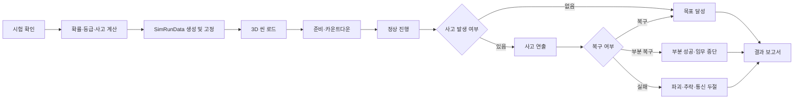

# 06. 자동 3D 시뮬레이션 공통 설계

> 상태: **확정**  
> 핵심 원칙: 결과를 계산하는 시스템과 결과를 보여주는 3D 연출을 분리한다.

## 1. 정의

본 게임에서 “시뮬레이션”은 플레이어가 조종하는 실시간 물리 게임이 아니다. 연구 진행도, 이전 단계 기술, 환경, 난수로 산출된 결과를 3D 장면에서 자동으로 재생하는 **연출형 시뮬레이션**이다.

복잡한 실제 물리 계산보다 다음 경험을 우선한다.

- 내 선택으로 성공 확률이 달라졌다는 이해
- 결과가 바로 드러나지 않는 긴장
- 환경 위험이 실제 3D 장면에 나타나는 볼거리
- 성공, 복구, 중단, 실패가 명확히 구분되는 연출

## 2. 공통 처리 흐름



## 3. 플레이어 입력

시뮬레이션 도중 허용되는 입력:

- 카메라 전환 버튼: 선택 사항
- `2배속`: P1
- `결과까지 건너뛰기`: 동일 시험을 한 번 이상 본 뒤 사용 가능
- 일시정지: 기본 시스템 메뉴

금지되는 입력:

- 추력 조절
- 회전
- 경로 수정
- 사고 복구 버튼
- QTE
- 결과 재굴림
- 연료 또는 장비 선택

## 4. 결과는 씬 진입 전에 고정

`SimRunData`에는 아래 정보가 들어간다.

```text
stageId
year
quarter
environmentId
currentProgress
prerequisiteAverage
experienceBonus
successChance
partialChance
failChance
roll
grade
incidentId
incidentRecovered
seed
generatedMetrics
```

3D 씬은 `SimRunData`를 읽어 연출만 선택한다. 씬 내부에서 성공 여부를 다시 계산하지 않는다.

## 5. 공통 시퀀스 구조

모든 시험은 아래 6단계를 공유한다.

1. **브리핑**: 시험명, 날짜, 환경
2. **카운트다운**: 3~5초
3. **정상 진행**: 점화, 상승, 궤도 진입, 하강 등
4. **위험 구간**: 사고가 발생할 수 있는 시점
5. **결과 구간**: 목표 달성, 중단, 추락, 폭발
6. **결과 보고서 전환**

모든 시험에서 결과 텍스트를 시뮬레이션 시작 직후 보여주지 않는다. 최소한 정상 진행 구간을 거친 뒤 경고 또는 성공을 드러낸다.

## 6. 등급별 공통 연출 규칙

| 등급 | 공통 연출 |
|---|---|
| S | 안정적인 진행, 강한 성공 연출, 선택적으로 근접 위기 1회 |
| A | 경미한 경고 발생 후 자동 복구, 목표를 여유 있게 달성 |
| B | 뚜렷한 문제 발생 후 가까스로 복구, 목표를 최소 기준으로 달성 |
| C | 목표 일부 달성 후 자동 중단·복귀·조기 종료 |
| F | 주요 장비 손상, 폭발, 추락, 궤도 상실 또는 착륙 실패 |

S/A/B는 서로 다른 전체 영상을 만들지 않는다. 성공용 기본 시퀀스를 공유하고 경고 강도, 카메라, 지표, 효과만 다르게 한다. C와 F만 별도 결말 분기를 둔다.

## 7. 사고 수 제한

한 시험에는 주요 사고가 하나만 발생한다.

예외적으로 다음은 주요 사고로 계산하지 않는다.

- 작은 스파크
- 계기판 순간 경고
- 유성 근접 통과
- 카메라 흔들림
- 통신 노이즈

두 사고를 연쇄적으로 구현하지 않는다. “유성 충돌 후 엔진 폭발 후 통신 두절” 같은 복합 시나리오는 금지한다.

## 8. 권장 재생 시간

| 시험 | 첫 재생 목표 | 재시도 시 2배속 |
|---|---:|---:|
| 엔진 | 20~25초 | 10~13초 |
| 로켓 | 30~40초 | 15~20초 |
| 궤도 | 35~45초 | 18~23초 |
| 달 착륙 | 45~60초 | 23~30초 |

카운트다운이 지나치게 길어 반복 플레이를 방해하지 않도록 한다.

## 9. 카메라 원칙

- 각 시험은 3~5개의 고정 카메라 구도를 사용한다.
- 자유 카메라는 만들지 않는다.
- 위험 발생 직전에는 텔레메트리 또는 기체 클로즈업으로 긴장감을 높인다.
- 실패 순간은 한 번 명확하게 보여주되 과도한 슬로모션은 사용하지 않는다.
- 결과를 알아보기 어려운 원거리 구도만 사용하지 않는다.
- 카메라 전환은 미리 정한 시간 또는 시뮬레이션 상태에 의해 자동 실행한다.

## 10. 텔레메트리 원칙

3D 화면에는 실제 계산값처럼 보이는 최소 지표를 표시한다. 이 값은 등급에 맞게 사전 생성한 연출용 값이다.

- 플레이어가 결과를 예측할 단서가 되어야 한다.
- 사고 직전 값이 비정상적으로 변화해야 한다.
- 성공 시 목표 기준을 넘는 모습이 보여야 한다.
- 결과 보고서의 수치와 모순되지 않아야 한다.

## 11. 환경 표현

환경 상태는 확률 수치와 3D 장면에 모두 반영한다.

- 강풍: 빠른 구름, 발사대 깃발 또는 먼지, 로켓 흔들림
- 뇌우: 어두운 하늘, 비, 번개, 통신 잡음
- 유성우: 우주 배경의 유성 궤적, 근접 통과 또는 충돌
- 태양 폭풍: HUD 노이즈, 붉은 경고, 전자장비 오류
- 최적 발사창: 깨끗한 하늘, 안정된 텔레메트리

환경마다 완전히 새로운 씬을 만들지 않고 파티클, 조명, 오버레이를 켜고 끄는 방식으로 처리한다.

## 12. 재사용 구조

공유 요소:

- 시뮬레이션 진입과 종료
- `SimRunData`
- 카운트다운
- 상태 전환
- HUD
- 경고음
- 환경 효과 활성화
- 결과 화면 호출
- 2배속과 건너뛰기
- 결과 고정

단계별 요소:

- 배경
- 기체 또는 엔진 모델
- 경로 애니메이션
- 사고 연출
- 표시 지표
- 성공·부분 성공·실패 결말

## 13. 실제 물리 사용 범위

허용:

- 실패 시 로켓 또는 착륙선에 Rigidbody를 활성화해 넘어지거나 추락
- 폭발 시 파편 또는 단순한 힘 적용
- 엔진 불꽃과 연기 파티클
- 카메라 흔들림

필수 아님:

- 정확한 추력 계산
- 공기저항 계산
- 실제 연료 질량 변화
- 궤도역학
- N-body 중력
- 실제 대기권 모델

## 14. 공통 완료 기준

- 같은 입력 데이터면 같은 등급과 사고를 재생한다.
- 환경이 확률과 장면에 모두 반영된다.
- 시뮬레이션 중 플레이어 조작이 결과를 바꾸지 않는다.
- S/A/B/C/F의 결말을 시각적으로 구분할 수 있다.
- 결과 보고서로 돌아온 뒤 진행도와 연구비가 정확히 반영된다.
- 건너뛰어도 결과 적용이 한 번만 일어난다.
