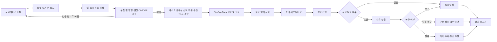

# 06. 로켓 설계와 자동 3D 시뮬레이션 공통 설계

> 상태: **확정**  
> 핵심 원칙: 발사 전 설계 입력과 발사 후 자동 연출을 분리한다.

## 1. 정의

본 게임에서 “시뮬레이션”은 두 부분으로 나뉜다.

1. **로켓 설계 단계**: 이번 맵과 목표 경로를 보고 부품 위치, 힘, 방향을 조정한다.
2. **자동 발사 단계**: `발사` 버튼 이후 플레이어 입력 없이 로켓이 설계대로 움직이고 결과를 보여준다.

발사 중에는 플레이어가 조종하는 실시간 물리 게임이 아니다. 연구 진행도, 이전 단계 기술, 설계 적합도, 테스트 공개성, 난수로 산출된 결과를 3D 장면에서 자동으로 재생하는 **연출형 시뮬레이션**이다.

복잡한 실제 물리 계산보다 다음 경험을 우선한다.

- 내 선택으로 성공 확률이 달라졌다는 이해
- 맵과 목표 경로를 보고 직접 설계했다는 이해
- 결과가 바로 드러나지 않는 긴장
- 설계 실수와 복구가 실제 3D 장면에 나타나는 볼거리
- 성공, 복구, 중단, 실패가 명확히 구분되는 연출

## 2. 공통 처리 흐름



## 3. 플레이어 입력

설계 단계에서 허용되는 입력:

- 부품 위치 조정
- 힘 크기 조정
- 힘 방향 조정
- 엔진 ON/OFF 타이밍 조정
- 공개 테스트 또는 비공개 테스트 선택
- 설계 초기화
- 연구 단계로 돌아가기
- `발사` 최종 실행

설계 단계에서 금지되는 입력:

- 새 자원 구매
- 인벤토리식 부품 수량 관리
- 발사 결과 미리 보기
- 난수 재굴림
- 날씨와 환경 예보 선택

`연구 단계로 돌아가기`는 발사 전까지만 가능하다. 돌아가도 비용, 분기, 발사 횟수는 소비하지 않는다.

자동 발사 도중 허용되는 입력:

- 카메라 전환 버튼: 선택 사항
- `2배속`: P1
- `결과까지 건너뛰기`: 동일 발사를 한 번 이상 본 뒤 사용 가능
- 일시정지: 기본 시스템 메뉴

자동 발사 도중 금지되는 입력:

- 추력 조절
- 회전
- 경로 수정
- 사고 복구 버튼
- QTE
- 결과 재굴림
- 연료 또는 장비 선택

## 4. 결과는 발사 버튼 직후 고정

`SimRunData`에는 아래 정보가 들어간다.

```text
stageId
year
quarter
mapSeed
targetPathId
launchVisibility
currentProgress
prerequisiteAverage
experienceBonus
designFit
engineToggleSchedule
successChance
partialChance
failChance
roll
grade
incidentId
incidentRecovered
seed
generatedMetrics
```

자동 발사 씬은 `SimRunData`를 읽어 연출만 선택한다. 씬 내부에서 성공 여부를 다시 계산하지 않는다. 설계 씬에서는 `DesignData`를 만들지만 `발사` 버튼 전에는 `SimRunData`를 만들지 않는다.

## 5. 설계 단계 구조

설계 단계는 현재 선택 단계마다 같은 기본 UI를 공유한다.

필수 요소:

- 이번 맵
- 목표 경로
- 출발 지점과 목표 지점
- 테스트 공개성 선택
- 현재 설계의 적합도
- 성공·부분 성공·실패 예상 확률
- 연구 단계로 돌아가기 버튼
- 발사 버튼

맵은 현재 단계, 날짜, 세션 시드를 기반으로 생성한다. 같은 분기와 같은 단계에서 설계 화면을 나갔다가 다시 들어오면 같은 맵을 보여준다. 새 분기로 넘어가거나 새 게임을 시작하면 다른 맵이 나올 수 있다.

설계 조정은 단순해야 한다.

- 부품은 단계별로 정해진 슬롯 또는 제한된 부착점에 놓는다.
- 힘은 슬라이더 또는 드래그 핸들로 조정한다.
- 방향은 각도 핸들로 조정한다.
- 엔진 ON/OFF는 초 단위 또는 경로 지점 단위로 조정한다.
- 복잡한 다단 분리, 부품 구매, 자유 제작은 만들지 않는다.

## 6. 공통 시퀀스 구조

모든 자동 발사는 아래 6단계를 공유한다.

1. **브리핑**: 발사명, 날짜, 테스트 공개성
2. **카운트다운**: 3~5초
3. **정상 진행**: 점화, 상승, 궤도 진입, 하강 등
4. **위험 구간**: 사고가 발생할 수 있는 시점
5. **결과 구간**: 목표 달성, 중단, 추락, 폭발
6. **결과 보고서 전환**

모든 발사에서 결과 텍스트를 시뮬레이션 시작 직후 보여주지 않는다. 최소한 정상 진행 구간을 거친 뒤 경고 또는 성공을 드러낸다.

## 7. 등급별 공통 연출 규칙

| 등급 | 공통 연출 |
|---|---|
| S | 안정적인 진행, 강한 성공 연출, 선택적으로 근접 위기 1회 |
| A | 경미한 경고 발생 후 자동 복구, 목표를 여유 있게 달성 |
| B | 뚜렷한 문제 발생 후 가까스로 복구, 목표를 최소 기준으로 달성 |
| C | 목표 일부 달성 후 자동 중단·복귀·조기 종료 |
| F | 주요 장비 손상, 폭발, 추락, 궤도 상실 또는 착륙 실패 |

S/A/B는 서로 다른 전체 영상을 만들지 않는다. 성공용 기본 시퀀스를 공유하고 경고 강도, 카메라, 지표, 효과만 다르게 한다. C와 F만 별도 결말 분기를 둔다.

## 8. 사고 수 제한

한 발사에는 주요 사고가 하나만 발생한다.

예외적으로 다음은 주요 사고로 계산하지 않는다.

- 작은 스파크
- 계기판 순간 경고
- 유성 근접 통과
- 카메라 흔들림
- 통신 노이즈

두 사고를 연쇄적으로 구현하지 않는다. “유성 충돌 후 엔진 폭발 후 통신 두절” 같은 복합 시나리오는 금지한다.

## 9. 권장 재생 시간

| 발사 | 첫 재생 목표 | 재시도 시 2배속 |
|---|---:|---:|
| 엔진 | 20~25초 | 10~13초 |
| 로켓 | 30~40초 | 15~20초 |
| 궤도 | 35~45초 | 18~23초 |
| 달 착륙 | 45~60초 | 23~30초 |

카운트다운이 지나치게 길어 반복 플레이를 방해하지 않도록 한다.

## 10. 카메라 원칙

- 각 발사는 3~5개의 고정 카메라 구도를 사용한다.
- 자유 카메라는 만들지 않는다.
- 위험 발생 직전에는 텔레메트리 또는 기체 클로즈업으로 긴장감을 높인다.
- 실패 순간은 한 번 명확하게 보여주되 과도한 슬로모션은 사용하지 않는다.
- 결과를 알아보기 어려운 원거리 구도만 사용하지 않는다.
- 카메라 전환은 미리 정한 시간 또는 시뮬레이션 상태에 의해 자동 실행한다.

## 11. 텔레메트리 원칙

3D 화면에는 실제 계산값처럼 보이는 최소 지표를 표시한다. 이 값은 등급에 맞게 사전 생성한 연출용 값이다.

- 플레이어가 결과를 예측할 단서가 되어야 한다.
- 사고 직전 값이 비정상적으로 변화해야 한다.
- 성공 시 목표 기준을 넘는 모습이 보여야 한다.
- 결과 보고서의 수치와 모순되지 않아야 한다.

## 12. 설계 실패 표현

설계 항목은 성공률 수치와 3D 장면에 모두 반영한다.

- 부품 위치 오류: 구조 흔들림, 무게중심 경고
- 힘 부족: 상승 둔화, 목표 고도 미달
- 힘 과다: 자세 불안정, 경로 초과
- 방향 오류: 목표 경로 이탈
- 엔진 ON 타이밍 오류: 늦은 가속, 진입 각도 미달
- 엔진 OFF 타이밍 오류: 과속, 연료 낭비, 목표 지점 초과

각 설계 실패마다 완전히 새로운 씬을 만들지 않고 텔레메트리, 카메라 흔들림, 경고 텍스트, 경로 이탈 애니메이션을 조합한다.

## 13. 재사용 구조

공유 요소:

- 시뮬레이션 진입과 종료
- 설계 단계 UI
- 맵과 목표 경로 생성
- `DesignData`
- `SimRunData`
- 카운트다운
- 상태 전환
- HUD
- 경고음
- 결과 화면 호출
- 2배속과 건너뛰기
- 발사 버튼 이후 결과 고정

단계별 요소:

- 배경
- 기체 또는 엔진 모델
- 경로 애니메이션
- 사고 연출
- 표시 지표
- 성공·부분 성공·실패 결말

## 14. 실제 물리 사용 범위

허용:

- 실패 시 로켓 또는 착륙선에 Rigidbody를 활성화해 넘어지거나 추락
- 폭발 시 파편 또는 단순한 힘 적용
- 엔진 불꽃과 연기 파티클
- 카메라 흔들림
- 설계 적합도를 보여주는 단순 예상 경로

필수 아님:

- 정확한 추력 계산
- 공기저항 계산
- 실제 연료 질량 변화
- 궤도역학
- N-body 중력
- 실제 대기권 모델

## 15. 공통 완료 기준

- 같은 입력 데이터면 같은 등급과 사고를 재생한다.
- 같은 분기·단계·시드면 같은 맵과 목표 경로를 보여준다.
- 설계 적합도와 테스트 공개성이 성공률과 장면에 반영된다.
- 설계 단계에서 발사 전 연구 화면으로 돌아갈 수 있다.
- 발사 중 플레이어 조작이 결과를 바꾸지 않는다.
- S/A/B/C/F의 결말을 시각적으로 구분할 수 있다.
- 결과 보고서로 돌아온 뒤 진행도와 연구비가 정확히 반영된다.
- 건너뛰어도 결과 적용이 한 번만 일어난다.
