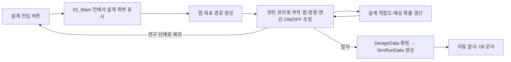

# 07. 로켓 설계

> 상태: **확정**  
> 역할: 발사 전에 로켓을 조립하고 설계 적합도를 확인하는 단계  
> 적용 우선순위: 조립 규칙과 설계 입력은 이 문서를 우선한다. 엔진 스탯 수치와 확률 계산식은 `06_엔진_연구.md`를 우선하고, 발사 버튼 이후의 자동 연출은 `08_로켓_발사.md`를 우선한다.

## 1. 정의

시뮬레이션은 두 부분으로 나뉜다.

1. **로켓 설계 단계**: 이번 맵과 목표 경로를 보고 부품 위치, 힘, 방향, 엔진 ON/OFF 타이밍을 조정한다. 이 문서가 담당한다.
2. **자동 발사 단계**: `발사` 버튼 이후 플레이어 입력 없이 로켓이 설계대로 움직인다. `08_로켓_발사.md`가 담당한다.

설계 단계에서 우선하는 경험:

- 내 선택으로 성공 확률이 달라졌다는 이해
- 맵과 목표 경로를 보고 직접 조립했다는 이해
- 조립 실수가 발사 결과로 이어진다는 이해

## 2. 처리 흐름



## 3. 플레이어 입력

허용:

- 부품 부착과 재배치
- 개발된 엔진 프리셋 추가와 제거
- 카메라 회전
- 힘 크기 조정
- 힘 방향 조정
- 엔진 ON/OFF 타이밍 조정
- 공개 테스트 또는 비공개 테스트 선택
- 설계 초기화
- 연구 단계로 돌아가기
- `발사` 최종 실행

금지:

- 연구비 외 새 자원 구매
- 인벤토리식 부품 수량 관리
- 발사 결과 미리 보기
- 난수 재굴림
- 날씨, 환경 예보, 발사창 보정 선택

`연구 단계로 돌아가기`는 발사 전까지만 가능하다. 돌아가도 확정 비용, 분기, 발사 횟수를 소비하지 않는다. 설계 단계 진입과 일반 설계 수정은 비용과 분기를 소비하지 않는다. 단, 개발된 엔진 프리셋 중 하나를 추가하면 설치 비용이 연구비에서 예약 표시된다. 엔진을 제거하거나 연구 단계로 돌아가면 예약 비용은 환불된다. 되돌릴 수 없는 행동은 `발사` 버튼 하나뿐이며, 이때 엔진 설치 비용과 발사 비용이 함께 확정 차감된다.

## 4. 설계 화면 구성

필수 요소:

- 이번 맵
- 목표 경로
- 출발 지점과 목표 지점
- 엔진 프리셋 선택과 설치 예약 비용
- 테스트 공개성 선택
- 현재 설계의 적합도
- 성공·부분 성공·실패 예상 확률
- 연구 단계로 돌아가기 버튼
- 발사 버튼

맵은 현재 단계, 날짜, 세션 시드를 기반으로 생성한다. 같은 분기와 같은 단계에서 설계 화면을 나갔다가 다시 들어오면 같은 맵을 보여준다. 새 분기로 넘어가거나 새 게임을 시작하면 다른 맵이 나올 수 있다.

설계 조정은 단순해야 한다.

- 힘은 슬라이더 또는 드래그 핸들로 조정한다.
- 방향은 각도 핸들로 조정한다.
- 엔진은 현재 개발된 Engine01~Engine10 중 골라 부착점에 추가한다.
- 엔진 ON/OFF는 초 단위 또는 경로 지점 단위로 조정한다.
- 복잡한 다단 분리, 부품 구매, 자유 제작은 만들지 않는다.

## 5. 조립 규칙

프로토타입에서 확정한 조립 방식을 그대로 사용한다. 구현 기록은 `docs/rocket-simulation.md`에 있다.

- **표면 자유 부착**: 부착 지점은 커서 레이캐스트가 로켓 표면에 맞은 지점이다. 고정 슬롯을 쓰지 않는다. 커서가 가리키는 표면 좌표가 곧 부착 좌표이므로 카메라가 어느 각도에 있어도 보이는 자리에 그대로 붙는다.
- **부품 자세는 플레이어가 정한다**: 부착한 엔진을 클릭해 선택하면 이동·회전 버튼이 뜨고, 회전시킨 자세가 그대로 유지된다. 축과 각도에 제한이 없고 스냅도 없다.
- **추력은 부품의 up을 따른다**: 로켓의 up이 아니다. 눕힌 엔진은 눕힌 방향으로 힘을 내므로 보이는 방향과 실제 힘 방향이 항상 일치한다. 이것이 §3의 "힘 방향 조정"이 설계 화면에서 나타나는 형태다. 엔진을 뒤집으면 로켓을 땅으로 밀어내는 배치도 만들 수 있다 — 잘못 조립하면 잘못 난다.
- **엔진은 좌측 프리셋 패널에서 꺼낸다**: 항목에 마우스를 올리면 그 프리셋의 가격·연료 탱크·냉각·최대 출력·점화 신뢰도가 표시된다. 드래그해서 로켓 표면에 놓으면 그 자리에 부착되고, 바닥에 놓으면 바닥에 놓이며, 그 외에는 취소된다. 선택한 엔진은 `Delete`로 지운다.
- **카메라는 로켓 중심 궤도**: 우클릭 드래그로 회전한다. 좌클릭은 부품 드래그가 점유한다. pitch는 `-20°~80°`로 제한해 카메라가 지면 아래로 넘어가지 않게 한다.
- **비대칭 배치는 토크를 만든다**: 추력은 무게중심이 아니라 엔진이 실제로 붙은 자리에 걸린다. 엔진 1개는 기울고, 좌우 대칭 2개는 토크가 상쇄되어 똑바로 올라간다. "제대로 조립해야 똑바로 난다"는 게임성이 여기서 나온다.
- **연료는 엔진 부품별**: 로켓 공용 탱크가 아니다. 엔진마다 값이 다르면 소진 시점이 어긋나 후반에 비대칭 토크가 생긴다. 이것이 부품 조합 실험의 핵심이다.
- **재배치 허용**: 이미 붙인 부품을 다시 집어 다른 위치에 붙일 수 있다.
- **정렬 가이드**: 부품을 끄는 동안 이미 붙어 있는 엔진과 높이 또는 방위각이 임계값 안으로 들어오면 그 자리에 선이 뜨고 좌표가 정확히 맞춰진다. 높이가 맞으면 수평 링, 방위각이 맞으면 세로선이다. Figma의 정렬 가이드와 같은 방식으로 두 축은 독립이다. 임계값 밖에서는 보정하지 않으므로 의도적인 비대칭 배치가 그대로 가능하고, 기존에 붙어 있는 부품은 절대 움직이지 않는다. 설계 근거는 `docs/specs/rocket-symmetry-assist-spec.md`에 있다.

의도적으로 만들지 않는 것:

- 그리드 스냅 (정렬 가이드는 기존 부품 기준이며, 좌표를 격자로 양자화하지 않는다)
- 엔진 3개 이상의 등분 자동 배치 (균등 배치는 플레이어가 맞춘다)
- 토크 균형 표시 (배치가 균형인지 아닌지는 발사해 봐야 안다)
- 회전 자세의 정렬·스냅 (자세는 언제나 플레이어가 정한다)
- 부품 겹침 검사
- 단 분리, 짐벌 제어
- 항력과 고도별 대기밀도
- 연료 소모에 따른 질량 감소

## 6. 엔진 스탯 반영

로켓에 배치하는 각 엔진은 `06_엔진_연구.md`에서 개발한 프리셋별 네 가지 스탯을 그대로 가진다. 같은 프리셋 엔진을 여러 개 달면 같은 업그레이드 상태를 공유하지만, 설치 비용은 엔진 개체마다 따로 든다.

| ID | 표시 이름 | 주요 기능 |
|---|---|---|
| `FuelCapacity` | 연료 탱크 용량 | 연소 시간을 늘리지만 탱크 무게를 증가시킨다 |
| `Cooling` | 냉각 능력 | 열을 배출하고 연소와 출력 제어를 안정적으로 유지한다 |
| `MaxOutput` | 최대 출력 | 무거운 로켓을 들어 올릴 추력을 제공한다 |
| `IgnitionReliability` | 점화 신뢰도 | 엔진이 정상적으로 점화되고 재점화될 가능성을 높인다 |

각 스탯은 `0~100` 범위다. 설계 단계에서는 스탯을 올릴 수 없고, 배치된 엔진 프리셋의 스탯을 읽어 쓰기만 한다.

### 6.1 설계 화면에서의 작동

| 스탯 | 작동 |
|---|---|
| 연료 탱크 용량 | 연소 가능 시간의 상한을 정하고 엔진 무게를 올린다. |
| 냉각 능력 | 최대 출력 대비 부족하면 과열 위험을 경고로 표시한다 |
| 최대 출력 | 힘 슬라이더의 상한을 정한다. 로켓 총 무게 대비 부족하면 목표 고도 미달을 경고한다 |
| 점화 신뢰도 | 점화와 재점화 성공 확률에 반영해 발사 전 성공률 표시에 포함한다 |

자동 발사에서 각 스탯이 어떤 지표와 사고로 나타나는지는 `08_로켓_발사.md`가 정한다.

### 6.2 스탯 상관관계

높은 스탯이 항상 좋은 결과만 만들지 않는다. 최대 출력을 높이면 더 많은 연료와 냉각 능력이 필요하다. 냉각 능력이 부족하면 열, 연소와 출력 제어가 함께 불안정해진다. 점화 신뢰도가 낮으면 충분히 개발한 엔진도 점화를 시작하지 못할 수 있다.

| 상태 | 발생 조건 | 예상 문제 |
|---|---|---|
| 큰 탱크와 낮은 출력 | 연료 탱크가 최대 출력보다 크게 높음 | 탱크 무게 때문에 목표 추력 미달 |
| 높은 출력과 작은 탱크 | 최대 출력이 연료 탱크보다 크게 높음 | 연료 조기 소진과 연소 시간 부족 |
| 높은 출력과 낮은 냉각 | 최대 출력이 냉각 능력보다 높음 | 과열, 추력 진동, 제어 실패 또는 폭발 |
| 높은 출력과 낮은 점화 신뢰도 | 최대 출력이 점화 신뢰도보다 크게 높음 | 점화 실패 또는 재점화 실패 |

플레이어는 발사 전에 성공 확률과 가장 위험한 두 가지 관계를 확인할 수 있다. 내부 계산식을 풀지 않아도 현재 엔진의 약점을 이해할 수 있어야 한다.

### 6.3 공통 규칙

- 엔진을 여러 개 배치하면 추력을 합산하고, 연소 가능 시간은 가장 짧은 엔진, 사고 위험은 가장 낮은 스탯을 기준으로 삼는다.
- 엔진을 추가할 때마다 해당 프리셋의 설치 비용이 예약된다.
- 엔진 제거, 설계 초기화, 연구 단계 복귀는 아직 확정되지 않은 설치 비용을 환불한다.
- 스탯값과 확률 계산식은 `06_엔진_연구.md`를 우선한다. 이 문서는 그 결과가 설계 화면에 어떻게 나타나는지만 정한다.

## 7. DesignData

설계 화면은 `DesignData`를 만든다. `발사` 버튼 전에는 `SimRunData`를 만들지 않는다.

```text
stageId
mapSeed
targetPathId
partPlacements
installedEngines
reservedEngineInstallCost
thrustScale
thrustDirection
engineToggleSchedule
designFit
launchVisibility
```

`partPlacements`는 부품마다 부품 ID, 로켓 로컬 좌표, 로컬 회전을 가진다.
`installedEngines`는 엔진 인스턴스 ID, 프리셋 ID, 부착 좌표, 회전, 설치 비용을 가진다.

## 8. 설계 오류 표현

설계 항목은 성공률 수치와 3D 장면에 모두 반영한다.

| 설계 오류 | 설계 화면 경고 | 발사 중 표현 |
|---|---|---|
| 부품 위치 불량 | 무게중심 이탈 경고 | 구조 진동, 기체 흔들림 |
| 비대칭 배치 | 예상 경로가 옆으로 휨 | 상승 중 기울어짐 |
| 힘 부족 | 목표 고도 미달 경고 | 상승 둔화, 목표 고도 미달 |
| 힘 과다 | 경로 초과 경고 | 과속, 자세 불안정 |
| 방향 오류 | 예상 경로가 목표 경로에서 벗어남 | 목표 경로 이탈 |
| 엔진 ON 타이밍 오류 | 연소 구간 표시 어긋남 | 늦은 가속, 진입 각도 미달 |
| 엔진 OFF 타이밍 오류 | 연료 초과 사용 경고 | 과속, 연료 낭비, 목표 지점 초과 |

각 설계 실패마다 새로운 씬을 만들지 않는다. 텔레메트리, 카메라 흔들림, 경고 텍스트, 경로 이탈 애니메이션을 조합한다.

## 9. 완료 기준

- 로켓 표면 어느 위치에나 부품을 붙이고 다시 옮길 수 있다.
- 카메라를 돌려도 부품이 보이는 자리에 그대로 붙는다.
- 같은 분기·단계·시드면 같은 맵과 목표 경로를 보여준다.
- 배치된 엔진의 스탯이 설계 적합도와 예상 확률에 반영된다.
- 엔진을 추가할 때마다 연구비 예약 비용이 표시된다.
- 엔진 제거와 연구 단계 복귀 시 예약 비용이 환불된다.
- 설계 적합도와 테스트 공개성이 성공률에 반영된다.
- 발사 전까지 연구 화면으로 돌아갈 수 있고, 돌아가도 비용과 분기를 소비하지 않는다.
- `발사` 버튼을 누른 시점에 `DesignData`가 확정되고 이후 수정할 수 없다.
